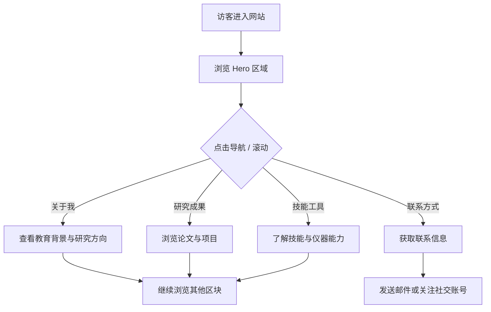

## 1. 产品概述

一款面向化学专业学生的个人介绍网站，旨在展示学术背景、研究方向、科研成果及个人风采。目标用户为学术同行、潜在导师、招聘方及对化学感兴趣的访客。

- 核心目标：打造一个兼具专业性与审美感的个人品牌展示页面
- 目标用户：学术同行、研究生导师、招聘企业、化学爱好者

## 2. 核心功能

### 2.1 用户角色

| 角色 | 访问方式 | 核心权限 |
|------|----------|----------|
| 访客 | 直接访问 | 浏览所有公开信息 |

### 2.2 功能模块

1. **首页（Hero）**：个人头像/姓名、化学主题视觉背景、一句话简介、导航入口
2. **关于我**：教育背景、研究方向、专业技能、个人简介
3. **研究成果**：发表论文列表、科研项目展示、实验成果
4. **技能与工具**：实验技能、仪器操作、软件工具能力可视化
5. **联系方式**：邮箱、社交媒体链接、所在院校信息

### 2.3 页面详情

| 页面名称 | 模块名称 | 功能描述 |
|----------|----------|----------|
| 首页 Hero | 导航栏 | 固定顶部导航，包含各区块锚点链接 |
| 首页 Hero | 个人标识 | 姓名、学位、研究领域标签、头像 |
| 首页 Hero | 动态背景 | 分子结构动画 / 化学反应视觉效果 |
| 关于我 | 教育经历 | 时间线形式展示本硕博教育背景 |
| 关于我 | 研究方向 | 卡片式展示主要研究方向与关键词 |
| 关于我 | 个人简介 | 图文并茂的自我介绍段落 |
| 研究成果 | 论文列表 | 按年份分组的论文卡片，含期刊名称与链接 |
| 研究成果 | 项目展示 | 科研项目卡片，含项目描述与技术亮点 |
| 技能工具 | 实验技能 | 技能标签云 / 进度条展示 |
| 技能工具 | 仪器操作 | 仪器名称与熟练度可视化 |
| 技能工具 | 软件能力 | 化学软件工具图标 + 熟练度展示 |
| 联系方式 | 联系表单 | 姓名、邮箱、留言（可选） |
| 联系方式 | 社交链接 | 图标链接到 ORCID、ResearchGate、GitHub 等 |
| 页脚 | 版权信息 | Copyright + 回到顶部按钮 |

## 3. 核心流程

访客进入网站后，首先看到带有化学视觉主题的 Hero 区域，通过导航栏可快速跳转至各内容区块。页面采用单页滚动设计，各区块按故事线顺序排列：我是谁 → 我做什么研究 → 我有什么成果 → 我拥有什么技能 → 如何联系我。

## 4. 用户界面设计

### 4.1 设计风格

- **主题**：实验室暗色风 —— 深色背景模拟实验室暗房氛围，搭配化学元素发光色彩
- **主色调**：深蓝黑 (#0a0e1a) 背景，荧光青 (#00e5ff) 为主强调色，化学橙 (#ff6d00) 为辅助强调色
- **辅助色**：分子紫 (#7c3aed)、溶液绿 (#10b981)、火焰金 (#f59e0b) 用于标签和装饰
- **字体**：
  - 标题：使用几何无衬线字体（Outfit / DM Serif Display 等特色字体）
  - 正文：清晰易读的无衬线字体（系统默认）
- **按钮**：微圆角、带发光边框效果，hover 时发光增强
- **布局**：单页滚动 + 固定导航，卡片式内容区块，不对称布局打破常规
- **图标**：化学相关自定义图标风格，配合 lucide-react 图标库
- **动画**：分子结构浮动装饰、化学键连接动画、滚动触发渐入效果
- **装饰元素**：苯环结构、分子式、电子轨道示意、烧杯/试管线条插画

### 4.2 页面设计概览

| 页面名称 | 模块名称 | UI 元素 |
|----------|----------|---------|
| Hero | 导航栏 | 固定顶部，半透明毛玻璃背景，右侧导航链接带下滑指示器 |
| Hero | 个人标识 | 居中大标题，姓名带荧光青发光效果，副标题展示研究领域，化学式装饰线条 |
| Hero | 动态背景 | Canvas 分子结构动画，分子节点带连线，缓慢浮动旋转 |
| 关于我 | 教育时间线 | 垂直时间线，左侧年份节点带发光圆点，右侧内容卡片 |
| 关于我 | 研究方向 | 三列网格卡片，每张带化学图标和渐变边框 |
| 研究成果 | 论文列表 | 年份分组，论文卡片左侧带期刊颜色条，hover 平移效果 |
| 技能工具 | 技能云 | 标签云排列，化学相关技能高亮，带悬浮放大效果 |
| 技能工具 | 仪器操作 | 进度条样式，渐变填充 + 发光效果，模拟试管液面 |
| 联系方式 | 联系信息 | 左侧联系表单，右侧社交图标网格，带 hover 旋转效果 |
| 页脚 | 版权 | 简洁居中，化学结构装饰线，回到顶部按钮 |

### 4.3 响应式设计

- 桌面端优先（1440px 最佳），向下适配
- 平板端（768px-1024px）：卡片网格改为两列，时间线紧凑排列
- 移动端（<768px）：单列布局，导航改为汉堡菜单，卡片全宽显示

## 5. 非功能性需求

- 性能：首次内容渲染 < 1.5s，动画帧率 ≥ 60fps
- 可访问性：语义化 HTML，颜色对比度符合 WCAG AA 标准
- SEO：合理的 meta 标签与结构化数据
- 浏览器兼容：支持 Chrome、Firefox、Safari、Edge 最新两个版本
