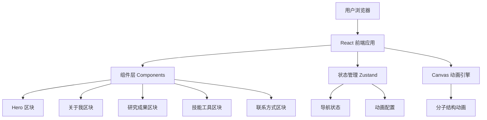

## 1. 架构设计



## 2. 技术说明

- **前端框架**：React@18 + TypeScript
- **样式方案**：Tailwind CSS@3 + 自定义 CSS 变量
- **构建工具**：Vite
- **初始化工具**：vite-init
- **状态管理**：Zustand
- **图标库**：lucide-react
- **动画**：CSS Animation + Canvas API + Framer Motion
- **后端**：无（纯前端静态网站）
- **部署**：静态文件托管（Vercel / Netlify / GitHub Pages）

## 3. 路由定义

| 路由 | 用途 |
|------|------|
| / | 单页应用首页，包含所有内容区块 |

本项目为单页应用，所有内容通过锚点导航在同一页面内展示。

## 4. API 定义

无后端 API。联系表单采用 `mailto:` 链接或前端表单验证后直接打开邮件客户端。

## 5. 组件结构

```
src/
├── components/
│   ├── layout/
│   │   ├── Navbar.tsx          # 固定导航栏
│   │   └── Footer.tsx          # 页脚
│   ├── hero/
│   │   ├── HeroSection.tsx     # Hero 区域容器
│   │   └── MoleculeCanvas.tsx  # Canvas 分子动画背景
│   ├── about/
│   │   ├── AboutSection.tsx    # 关于我容器
│   │   ├── EducationTimeline.tsx # 教育时间线
│   │   └── ResearchInterest.tsx  # 研究方向卡片
│   ├── publications/
│   │   ├── PublicationsSection.tsx # 研究成果容器
│   │   └── PaperCard.tsx         # 论文卡片
│   ├── skills/
│   │   ├── SkillsSection.tsx     # 技能工具容器
│   │   ├── SkillCloud.tsx        # 技能标签云
│   │   └── SkillBar.tsx          # 技能进度条
│   ├── contact/
│   │   ├── ContactSection.tsx    # 联系方式容器
│   │   └── SocialLinks.tsx       # 社交链接
│   └── ui/
│       ├── SectionTitle.tsx      # 区块标题组件
│       └── ScrollToTop.tsx       # 回到顶部按钮
├── hooks/
│   ├── useScrollSpy.ts           # 滚动监听高亮导航
│   └── useMoleculeAnimation.ts   # 分子动画 Hook
├── store/
│   └── useAppStore.ts            # Zustand 全局状态
├── data/
│   └── profile.ts                # 个人资料数据
├── types/
│   └── index.ts                  # TypeScript 类型定义
├── App.tsx
├── main.tsx
└── index.css                     # 全局样式 + CSS 变量
```

## 6. 数据模型

### 6.1 个人资料数据结构

```typescript
interface Profile {
  name: string
  title: string              // 学位/职称
  subtitle: string           // 一句话介绍
  researchFields: string[]   // 研究领域
  avatarUrl?: string
  about: string              // 个人简介
  education: Education[]
  publications: Publication[]
  projects: Project[]
  skills: SkillCategory[]
  contact: Contact
  social: Social[]
}

interface Education {
  degree: string
  school: string
  major: string
  period: string             // "2020-2023"
  description?: string
}

interface Publication {
  title: string
  journal: string
  year: number
  authors: string
  doi?: string
  abstract?: string
}

interface Project {
  name: string
  role: string
  description: string
  technologies: string[]
}

interface SkillCategory {
  category: string           // "实验技能" | "仪器操作" | "软件工具"
  items: Skill[]
}

interface Skill {
  name: string
  level: number              // 0-100
  icon?: string
}

interface Contact {
  email: string
  phone?: string
  address?: string
}

interface Social {
  platform: string           // "ORCID" | "ResearchGate" | "GitHub" 等
  url: string
  icon: string
}
```

### 6.2 初始数据

所有数据通过 `src/data/profile.ts` 以静态 JSON 对象形式提供，包含中文模板数据，用户可直接修改该文件更新网站内容。
